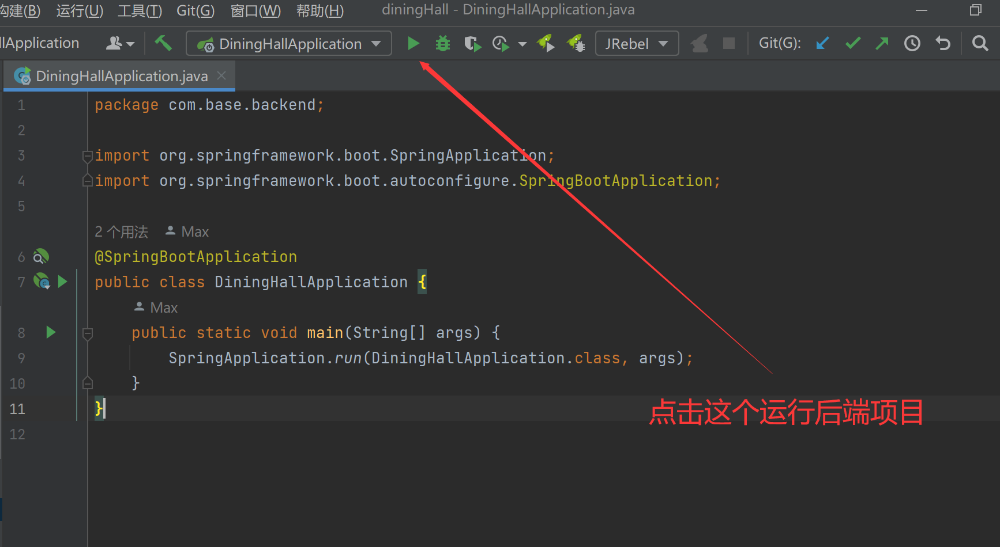

## DiningHall项目简介
本项目是面向对象大作业——智慧食堂的后端部分

### 项目环境
+ Java 8
+ IDEA 2022.2.3
+ maven 3.8.3
+ MySQL 8.0

### 运行项目

+ 运行sql脚本

    在后端代码文件中有一文件夹sql，其中存放得就是项目的sql文件，在本地运行即可

+ 修改项目properties文件

    按照下面提示，根据本地环境修改文件内容

    ```properties
    server.port=3000					
    
    # 数据库用户名
    spring.datasource.username=root			
    # 对应密码
    spring.datasource.password=123456		
    # 3306为本地mysql端口， diningHall是数据库名称
    spring.datasource.url=jdbc:mysql://localhost:3306/diningHall?serverTimezone=Asia/Shanghai&useUnicode=true&characterEncoding=utf-8		
    spring.datasource.driver-class-name=com.mysql.cj.jdbc.Driver
    
    ```

+ 运行项目

    